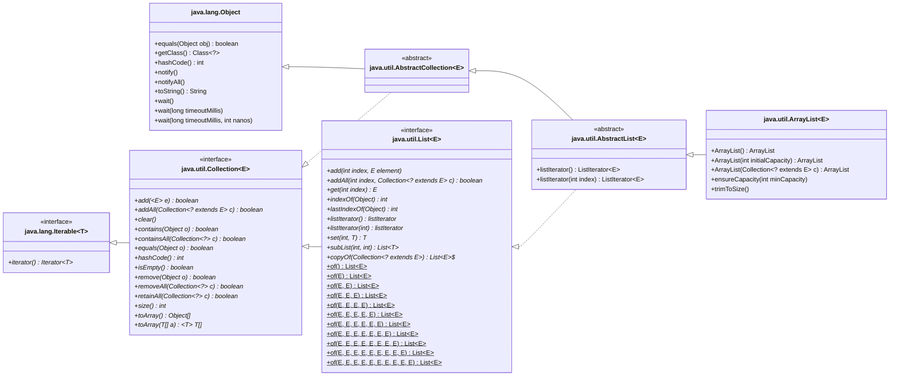
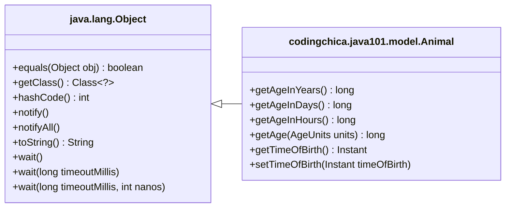

# Example UML Diagram - Class Diagram

## Mermaid Syntax

The following syntax uses the [Mermaid Class Diagram syntax](https://mermaid.js.org/syntax/classDiagram.html).  
If you are viewing this page on github, or in certain IDEs, it may render as a diagram, rather than text.

The [Mermaid Live editor](https://mermaid.live/edit) can be used to draft such diagrams if your IDE does not render
them as an image when viewing the markdown file.

More information:
- [UML diagrams](http://websites.umich.edu/~eecs381/handouts/UMLNotationSummary.pdf)

## java.util.ArrayList

## codingchica.java101.model.Animal

